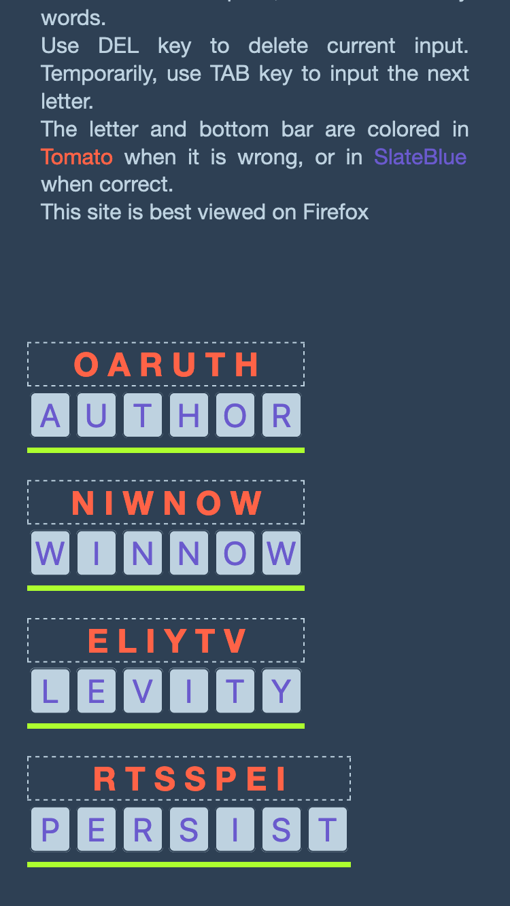

# Jumble Game in Ruby
Live demo [here!](https://ndlopez.github.io/jumble_game/)

## Motivation
The other day I was watching an episode of NewsRadio [S3EP04](https://youtu.be/gozYnV5bxL0) where Lisa (Maura Tierney) is reading the newspaper and then Matthew comes along having "the jumble fever" and wants to solve the Jumble of the day, at that moment Lisa joins in the game but she cant figure out the answer, Kathy who is in the back listening comes and joins the two and solves the jumble in a few seconds. Lisa asks her how did she do it, Kathy says, the letters say "pick me, I'm first".

In the same episode, they (Lisa and Dave) mention a book called <em>Flowers for Algernon</em> by Daniel Keyes about a super intelligent mouse. I oughta check it out.

Moving on... I made a quick duckduckgo search and I found Chicago Tribune's [Jumble Daily](https://fun.chicagotribune.com/game/tca-jumble-daily) page, free for anyone to play, in any way I decided to make my own.

I used the following list of [English Words](https://svnweb.freebsd.org/csrg/share/dict/words?view=log)

Ruby code reads the above TXT file and returns a JSON file with 4 words. JS code reads that remote JSON file and builds input and h2 tags to display the words.

## ScreenShot

## Features
1. As you input a correct letter, the top letters will change color, only those that have not changed match the remaining number of inputs for a word. 
2. Correct input letters are colored in SlateBlue, wrong inputs are colored in Tomato.
3. A bar at the bottom of the word changes its color when all the correct letters are inputted.
   
## Needed Features
1. Select some of the correct letters to build another phrase.
2. Display a report-like window displaying the meanings of the words.

## Known Issues
0. ~~Sometimes 2 of the jumble words are the same. This issue is probably related to the random value. I need to fix this by asking for another word.~~
1. ~~When all the correct letters are finally inputted on the boxes it should display a message saying "Congratulations you finished!"~~
2. ~~I added a bar at the bottom of each word. It changes only for the first word. The global counter does not match the current word length.~~
3. On mobile, none of the features work at all, i.e. no coloring of the correct input letter, nor the bar.
4. When SPACEBAR is input after a correct input, it double counts the correct answers, thus resulting on early display of success-window.

---
Environment: MacBook Pro, MacOS 15.5

Language: JavaScript, Ruby

Editor: Emacs
